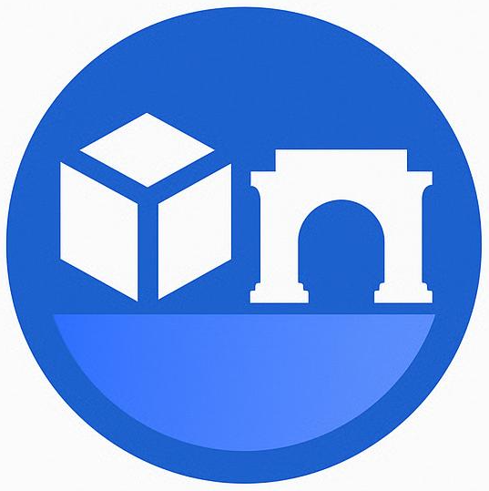

# TrueCastAgent

<p align="center">
  
</p>

TrueCastAgent powers the [TrueCast](https://warpcast.com/dudecaster/0x4128d6f5) mini app on [Farcaster](https://www.farcaster.xyz/), a new way to participate in prediction markets that's fast, social & onchain.

[](https://tip.md/phdargen)

## TrueCast

- Daily notifications for trending prediction markets from [TrueMarkets](https://app.truemarkets.org/en/markets)
- Quick bets directly from the social feed
- Notifications upon market resolutions and easy reward claims
- Activity feed leveraging the social graph

## TrueCastAgent

Built with CDP AgentKit, automates several key functions:
- Maintains up-to-date onchain information of prediction markets
- Categorizes markets (politics/sports/etc.)
- Selects daily featured markets considering liquidity + latest news relevance
- Posts market analysis on [X](https://x.com/trueCastAgent)/[Farcaster](https://warpcast.com/truecastagent)
- Makes automated bets using a $100 monthly allowance from a [Safe wallet](https://docs.safe.global/sdk/overview) via [0x](https://0x.org/)

## Scripts

- `npm start`: Runs the main TrueCastAgent that posts analysis and makes bets
- `npm run update-markets`: Updates and categorizes market data from TrueMarkets
- `npm run select-featured-market`: Selects the daily featured market based on liquidity and news relevance

## GitHub Actions

- `update-markets.yml`: update market data
- `featured-market.yml`: select the featured market
- `truecast-agent.yml`: post analysis and make automated bets

## AgentKit Enhancements

This repository uses a forked version of [CDP AgentKit](https://github.com/coinbase/agentkit) with several new features:
- Trading via 0x [#681](https://github.com/coinbase/agentkit/pull/681)
- Truemarkets information integration [#614](https://github.com/coinbase/agentkit/pull/614)
- Post embeds on Farcaster + media on Twitter [#675](https://github.com/coinbase/agentkit/pull/675)
- Safe wallet provider [#330](https://github.com/coinbase/agentkit/pull/330)

## Clone the Repository

This repository contains submodules. To clone the repository with all submodules, use:

```bash
git clone --recurse-submodules https://github.com/phdargen/trueCastAgent.git
cd trueCastAgent
```

If you've already cloned the repository without submodules, you can initialize and update them with:

```bash
git submodule init
git submodule update
```

## Build Instructions

1. Build the AgentKit module:
   ```bash
   cd cdp-agentkit/typescript
   pnpm i && pnpm build
   ```

2. (Optional) Run the interactive chatbot example:
   ```bash
   cd cdp-agentkit/typescript/examples/langchain-cdp-chatbot
   pnpm run start
   ```

3. Build and run myAgent:
   ```bash
   cd myAgent
   npm install
   npm start
   ```
